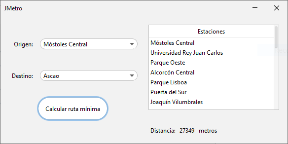

# jMetro

> jMetro is a desktop Java application that computes the shortest path between
Metro de Madrid stations.

[](https://github.com/jiep/jMetro/actions/workflows/CI.yml)

<p align="center">
  
</p>

## Prerequisites

* [Java](https://www.java.com)

## Installation

Download the latest version from [Releases](https://github.com/jiep/jMetro/releases).

### Run jar

Double click on `jMetro-x.y.jar` or run the following command on `Terminal`

```bash
java -jar target/jMetro-x.y.jar
```

## Build from source

> NOTE: [Maven](https://maven.apache.org) is required to build from source.

Run the following command:

```bash
mvn clean compile resources:resources assembly:single
```

Resulting `jar` is contained in folder `target`.

## Contributing

Pull requests are welcome. For major changes, please open an issue first to discuss what you would like to change.

## License
This project is licensed under the MIT License - see the [LICENSE](./LICENSE) file for details
